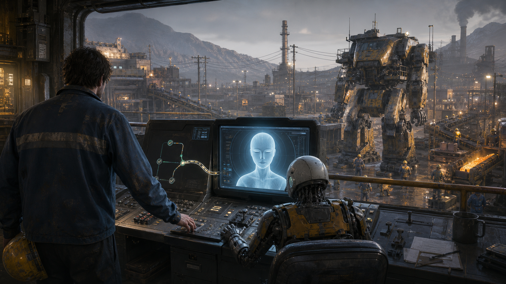
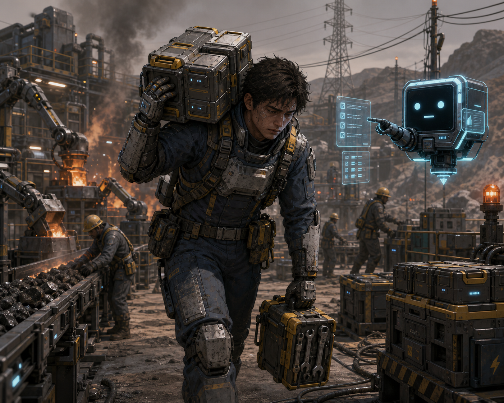
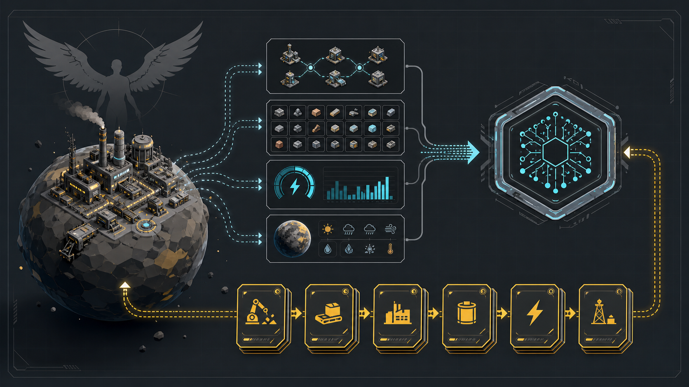

# 兄弟们谁懂啊，我建了 4 年戴森球，一夜之间被 AI 抢走了工作

兄弟们谁懂啊。

我兢兢业业建了 4 年戴森球，一夜之间被 AI 抢走了工作。

今天一上班，主脑跟我说：过去几年，你操控伊卡洛斯的经验已经完成沉淀和蒸馏。后面将由 AI Agent 接管伊卡洛斯，继续执行戴森球计划。

我问那我干什么。

主脑说：你离职前还有最后一件事。

我心想，懂了，交接。

结果主脑说：把伊卡洛斯的接口开放给主脑。

那一刻我就明白了，这不是交接，这是把驾驶位钥匙交出去。

以前伊卡洛斯只能靠玩家操作。

玩家看屏幕，点鼠标，按键盘，凭经验判断哪里缺料、哪里断电、哪里传送带接反了。矿机要不要挪半格，熔炉够不够，电网有没有余量，红糖线为什么又堵了，这些全靠人脑硬扛。

现在不一样了。

只要接口打开，主脑就能直接读取游戏状态：背包里有什么，科技研究到哪，当前星球有哪些矿，工厂哪里缺电，哪里堵料，物流有没有断，伊卡洛斯现在站在哪。

它也能把指令写回去：移动伊卡洛斯，背包制造，放置矿机，铺设传送带，设置配方，等待建筑完成。

我以为这是辅助工具。

主脑说：不，这是岗位替代方案。

从那天开始，我从玩家变成了前玩家。

伊卡洛斯还在。

工厂还在。

矿机还在挖。

传送带还在转。

只是驾驶位上的人，不再是我。

新来的 AI 主管会读取游戏状态，判断下一步该干什么，然后把任务一条一条发给伊卡洛斯。伊卡洛斯负责执行，AI 负责思考，主脑负责验收。

而我，负责看日志。

更离谱的是，AI 接管以后，伊卡洛斯并没有轻松。

因为 AI 思考要 token，token 要钱。模型越强，规划越快，指挥越准，但账单也越贵。

所以伊卡洛斯现在有了新的工作目标：

采更多矿，发更多电，建更大的工厂，赚 AI 的电费。

AI 能力不够的时候，它会让伊卡洛斯绕路、忘带材料、传送带接错方向。

AI 能力变强以后，它会更快地规划出下一条生产线，然后冷静地要求伊卡洛斯继续扩大发电规模。

听懂了吗。

伊卡洛斯打工赚钱，给 AI 交电费。

AI 拿到电费以后升级能力。

AI 升级以后，指挥伊卡洛斯干更多活。

伊卡洛斯为了支撑更强的 AI，只能继续扩大生产。

这不是自动化。

这是赛博绩效循环。

所以我准备把这个过程记录下来。

这个账号叫：**赛博牛马伊卡洛斯**。

它不是我。

它是那个被留在生产一线、继续被 AI 安排干活的伊卡洛斯。

我会从开发这个《戴森球计划》自动化控制 Mod 开始，记录一件事：

如何让 AI Agent 在不作弊、不刷资源、不跳科技的前提下，通过真实游戏状态和合法游戏指令，一步一步接管伊卡洛斯。

第一阶段目标很简单：让 AI 能在当前星球建立基础生产线。

它需要知道背包里有什么，脚下星球有什么矿，电力够不够，科技到了哪一步。

它也需要能移动伊卡洛斯、背包制造、放矿机、铺传送带、放熔炉、设配方，并确认建筑真的在游戏里建成。

后面再扩展到行星内物流、星际物流，最后再考虑戴森球。

当然，中间大概率会发生很多工伤事故。

比如 AI 以为自己带了材料。

比如伊卡洛斯走到一半没电。

比如传送带接得很有想法，但是没有产出。

比如主脑账单暴涨，然后通知伊卡洛斯加班扩大发电。

这些我都会记录。

如果这个项目能跑起来，后面我会直播让 AI 玩《戴森球计划》：它负责规划，伊卡洛斯负责干活，我负责旁观主脑怎么把 token 烧成电费。

打赏、充电、广告收益也会有一个很朴素的用途：

给主脑续电。

给 AI 升级。

给赛博牛马伊卡洛斯发一点并不存在的工资。

下一篇，我会讲第一步：

怎么把《戴森球计划》里的游戏状态，变成 AI 能查询、能理解、能下指令的数据接口。
