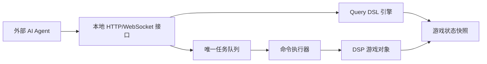

# AutomaticDSP 技术方案

## 总体架构

AutomaticDSP 分为游戏内 Mod 和外部调用接口两部分。



游戏内 Mod 负责：

- 在 Unity 主线程读取游戏状态。
- 维护查询快照。
- 接收外部查询与任务请求。
- 维护唯一顺序任务队列。
- 在游戏主线程逐帧执行命令。

外部 AI Agent 负责：

- 根据 Query DSL 查询结果做规划。
- 拆分目标为任务和命令。
- 观察任务状态并在失败时重新规划。

## 工程形态

Mod 使用 BepInEx 5 插件形式加载。插件入口为 `BaseUnityPlugin`。

第一版工程骨架只包含：

- BepInEx 插件入口。
- 对 DSP 游戏程序集的引用配置。
- 本地构建说明。

后续再按阶段添加 Query DSL、队列、命令执行器和建造适配器。

## 线程模型

Unity 和 DSP 游戏对象只能在游戏主线程安全访问。外部接口线程不得直接读写游戏对象。

推荐模型：

1. `Plugin.Update()` 在主线程驱动状态采样和命令执行。
2. HTTP/WebSocket 服务线程只负责接收请求。
3. 查询请求读取最近一次不可变快照；需要强一致结果时，将查询请求投递到主线程执行。
4. 任务提交请求只写入线程安全入队缓冲区。
5. 命令执行器每帧从唯一队列中推进当前任务。

## 模块划分

计划模块：

- `Plugin`：BepInEx 入口，初始化服务。
- `TransportServer`：本地接口服务，仅监听 `127.0.0.1`。
- `QueryEngine`：解析并执行 Query DSL。
- `GameSnapshotService`：生成实体快照。
- `TaskQueue`：唯一顺序任务队列。
- `CommandExecutor`：逐帧执行命令。
- `ValidationService`：校验科技、背包、地形、碰撞和距离。
- `MovementAdapter`：封装伊卡洛斯移动。
- `InventoryAdapter`：封装背包和手搓制造。
- `BuildAdapter`：封装建筑、传送带、分拣器、配方设置。

## Query DSL

### 设计原则

Query DSL 是只读接口，不改变游戏状态。

设计目标：

- 让外部 Agent 按实体自由查询。
- 减少传输体积。
- 避免外部 Agent 下载全量状态后自行过滤。
- 让任务、命令和队列状态也能用同一查询模型获取。

### 请求结构

```json
{
  "entity": "building",
  "filter": {
    "all": [
      { "field": "planetId", "op": "eq", "value": "current_planet" }
    ]
  },
  "select": ["id", "kind", "position"],
  "orderBy": [{ "field": "distanceToPlayer", "direction": "asc" }],
  "limit": 100,
  "cursor": null
}
```

字段说明：

- `entity`：实体类型。
- `filter`：过滤表达式。
- `select`：返回字段。为空时返回该实体的默认字段。
- `orderBy`：排序规则。
- `limit`：最大返回数量。
- `cursor`：分页游标。

### 过滤表达式

第一阶段支持：

- `eq`
- `neq`
- `lt`
- `lte`
- `gt`
- `gte`
- `in`
- `contains`
- `within_radius`
- `within_bbox`

组合表达式：

- `all`：全部条件满足。
- `any`：任一条件满足。
- `not`：条件取反。

### 上下文别名

DSL 支持少量内置别名：

- `current_planet`
- `player_position`
- `running_task`

别名只在服务端解析，不要求外部 Agent 知道游戏内具体 ID。

### 响应结构

```json
{
  "entity": "building",
  "items": [
    {
      "id": "building:1:1024",
      "kind": "smelter",
      "position": { "x": 130.0, "y": 35.0, "z": -78.5 }
    }
  ],
  "nextCursor": null,
  "snapshotTick": 123456,
  "warnings": []
}
```

查询失败时返回：

```json
{
  "error": {
    "code": "invalid_query",
    "message": "Unsupported operator: regex",
    "field": "filter.all[0].op"
  }
}
```

## 任务队列

### 单队列约束

系统只维护一个任务队列。所有任务按提交顺序进入同一个队列，命令执行器一次只推进一个任务。

这样做的原因：

- 游戏内建造行为与玩家位置强相关。
- 伊卡洛斯同一时间只能执行一个空间动作。
- 并行任务容易互相改变地形、库存、供电和建筑占位。

### API 草案

查询使用统一 DSL：

```http
POST /query
```

提交任务：

```http
POST /tasks
```

取消任务：

```http
POST /tasks/{taskId}/cancel
```

健康检查：

```http
GET /health
```

任务状态仍通过 `POST /query` 查询，`/tasks/{taskId}/cancel` 只作为状态修改命令存在。

### 任务持久性

第一阶段任务状态只保证当前游戏进程内可查询。游戏退出后不承诺恢复未完成任务。

后续如果需要跨会话恢复，再引入任务日志文件。当前不提前实现。

### 取消语义

取消不是强制打断任意游戏内部调用，而是请求命令执行器尽快进入安全停止状态。

- `queued`：直接标记为 `cancelled`。
- `running`：标记为 `cancel_requested`，当前原子命令结束后转为 `cancelled`。
- `succeeded` / `failed` / `cancelled`：保持原状态。

## 命令执行

### 命令生命周期

命令状态：

- `pending`
- `running`
- `succeeded`
- `failed`
- `skipped`

任务失败策略：

- 默认 `stopOnFailure = true`。
- 命令失败后，任务标记为 `failed`，后续命令不执行。
- 失败结果保留错误码、错误消息、命令 ID 和快照 tick。

### 原子命令

第一阶段每条命令应尽量小，便于取消和失败恢复。

示例：

- 移动到一个点。
- 放置一个建筑。
- 铺设一段传送带。
- 设置一个设施配方。
- 等待一个条件。

不要在一条命令里完成整条生产线。

## 游戏状态快照

快照应包含 Query DSL 可访问的实体数据。快照对象一旦生成，不再修改。

第一阶段建议先实现增量较低的全量当前行星快照，再按性能瓶颈优化空间索引。

快照字段建议：

- `snapshotTick`
- `gameTick`
- `currentPlanetId`
- `player`
- `inventorySummary`
- `technologySummary`
- `entities`
- `taskQueue`

对于建筑、矿脉等数量较多的实体，Query DSL 必须要求 `limit`，并优先支持空间过滤。

## 安全与访问控制

第一阶段接口只监听本机：

- 地址：`127.0.0.1`
- 默认端口：`39270`

不默认暴露到局域网。后续如需远程控制，应增加显式配置和鉴权。

## 实施阶段

### 阶段 0：文档与工程骨架

交付：

- 需求文档。
- 技术方案。
- BepInEx 插件工程骨架。

验证：

- 仓库结构清晰。
- 工程文件能定位 DSP 游戏程序集。
- 未安装 BepInEx 时有明确构建错误。

### 阶段 1：只读 Query DSL

交付：

- `POST /query`。
- 基础实体：`player`、`inventory`、`technology`、`planet`、`building`、`vein`、`task_queue`、`task`。

验证：

- 能查询玩家位置。
- 能查询当前行星附近建筑。
- 能查询空任务队列状态。

### 阶段 2：任务队列

交付：

- `POST /tasks`。
- `POST /tasks/{taskId}/cancel`。
- 任务和命令状态实体。
- `wait_until` 和内部 no-op 测试命令。

验证：

- 多任务按顺序执行。
- queued 任务可取消。
- running 任务可安全取消。

### 阶段 3：行星内建造命令

交付：

- `move_to`
- `craft_inventory`
- `place_building`
- `place_belt`
- `place_sorter`
- `set_recipe`

验证：

- 能建造一条简单铁块生产线。
- 材料或科技不足时返回明确错误。

## 风险

主要风险：

- DSP 内部类和字段随版本变化。
- 建造流程可能依赖 UI 状态或游戏内部工具状态。
- Unity 主线程和外部接口线程之间需要严格隔离。
- 大型行星状态查询可能产生性能压力。

缓解策略：

- 把游戏内部访问集中到 Adapter 层。
- Query DSL 默认要求投影和 limit。
- 第一阶段只支持当前行星。
- 优先使用游戏原生建造流程，避免直接改底层数组。
