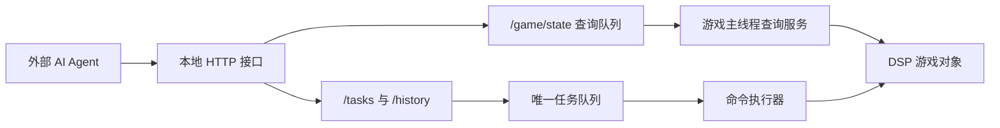

# AutomaticDSP 技术方案

> 当前实现以 `docs/development-plan.md` 为准：HTTP 使用 .NET 内置 `HttpListener`，JSON 使用 `Newtonsoft.Json`，已实现 `/game`、`POST /game/state`、`/tasks`、`/history`。`POST /game/state` 使用 GraphQL 作为字段选择 DSL。
> M1 状态查询结果保存在内存中；主菜单、菜单演示和加载界面通过 `GET /game` 表示运行状态。
> M1 HTTP 配置项包含 `HTTP.Host` 和 `HTTP.Port`，默认 `127.0.0.1:39270`，可把 host 改成 `0.0.0.0` 供外部调用。

## 总体架构

AutomaticDSP 分为游戏内 Mod 和本地 HTTP 接口两部分。GraphQL 只作为 `/game/state` 的只读字段选择 DSL，不承载任务提交或游戏控制写操作。



游戏内 Mod 负责：

- 在 Unity 主线程读取游戏状态。
- 每 tick 维护轻量游戏运行状态。
- 通过 `POST /game/state` 暴露按需状态查询。
- 通过任务接口提交、查询和取消任务。
- 维护唯一顺序任务队列。
- 在游戏主线程逐帧执行命令。

外部 AI Agent 负责：

- 根据状态查询结果做规划。
- 拆分目标为任务和命令。
- 观察任务状态并在失败时重新规划。

## 工程形态

Mod 使用 BepInEx 5 插件形式加载。插件入口为 `BaseUnityPlugin`。

第一版工程骨架包含：

- BepInEx 插件入口。
- 对 DSP 游戏程序集的引用配置。
- 本地构建说明。

后续再按阶段添加状态查询服务、队列、命令执行器和建造适配器。

`TargetFramework` 保持 `net472`。即使本机安装了 .NET 10 SDK，插件仍需要面向 Unity Mono 和 BepInEx 5 兼容的运行环境。

## 线程模型

Unity 和 DSP 游戏对象由游戏主线程安全访问。HTTP 请求线程通过队列与主线程交换请求和结果。

推荐模型：

1. `Plugin.Update()` 在主线程维护轻量游戏运行状态并驱动命令执行。
2. HTTP 服务线程负责接收 `POST /game/state`、解析 GraphQL 字段选择、入队和返回结果。
3. 游戏主线程每 60 game ticks drain 待查询队列，在同一个游戏 tick 内为每个请求生成最终 JSON。
4. HTTP 线程等待对应请求的最终 JSON 并返回主线程结果。
5. 任务提交或取消请求写入线程安全缓冲区，由游戏主线程处理游戏对象。
6. 命令执行器每帧从唯一队列中推进当前任务。

## 模块划分

计划模块：

- `Plugin`：BepInEx 入口，初始化服务。
- `HttpApiServer`：本地 HTTP 服务，默认监听 `127.0.0.1:39270`。
- `StateQueryParser`：解析 GraphQL 查询 AST，生成字段选择计划。
- `GameStateQueryService`：主线程维护轻量运行状态，并按请求读取游戏对象生成最终 JSON。
- `TaskQueueService`：内部唯一顺序任务队列，由任务接口暴露状态。
- `CommandExecutor`：逐帧执行命令。
- `ValidationService`：执行请求结构、游戏状态和命令前置条件校验；建造距离、地形、碰撞和连接规则优先委托游戏原生建造流程判断。
- `MovementAdapter`：封装伊卡洛斯移动。
- `InventoryAdapter`：封装背包和手搓制造。
- `BuildAdapter`：封装建筑、传送带、分拣器和游戏原生建造校验。
- `RecipeAdapter`：封装生产设施配方设置。

## GraphQL 字段选择 DSL

`POST /game/state` 使用 GraphQL 查询语法表达字段选择。

HTTP 线程职责：

1. 解析请求体 `{ "query": "...", "operationName": "..." }`。
2. 把 GraphQL selection AST 转成 `StateQueryPlan` 并加入主线程查询队列。
3. 等待主线程生成的最终 JSON，包装成 `{ "data": ... }` 返回。

游戏主线程在查询 tick drain 队列，并为每个请求单独执行字段读取、别名处理和分页处理。每个请求获得独立的一致状态视图，分页边界和同名字段参数按请求隔离。

### 查询根

第一阶段允许直接选择多个根字段：

- `metadata`
- `game`
- `gameMain`
- `data`
- `player` / `mainPlayer`
- `mecha`
- `inventory` / `package`
- `forge` / `replicator`
- `localPlanet` / `currentPlanet`
- `localStar`
- `factory` / `localFactory`
- `factoryDetails` / `localFactoryDetails`
- `factories`
- `production`
- `power`

`factory` / `localFactory` 返回游戏原始 `PlanetFactory`，`factoryDetails` / `localFactoryDetails` 返回 Agent 友好的当前行星工厂实体摘要。扩展根字段会按 `GameMain` 静态成员、`GameMain.instance` 成员、`GameMain.data` 成员依次尝试读取；字段读取失败以 `null` 表示。

### 查询规则

- 支持多 root 字段组合查询。
- 支持嵌套字段投影、fragment 和 inline fragment。
- 支持字段别名。
- 列表支持 `limit`、`offset` 和 `where`，默认最多 256 项，单次上限 2048。
- 支持 `_schema` 查询根和对象上的 `_fields` 字段，用于发现可查询入口和字段。
- 字段读取失败以 `null` 表示。
- 复杂对象默认展开一层可序列化字段。
- Unity 对象、委托、方法等运行时对象通过安全 JSON 形状输出。

第一阶段支持范围：

- 字段选择、别名、fragment、分页和 `where` 过滤。
- `_schema` 查询根和对象 `_fields` 字段发现。
- 游戏状态读取由主线程执行。
- 游戏状态修改通过任务和命令接口表达。

## 查询示例

一次查询获取玩家、背包、当前行星和当前工厂页：

```graphql
query ObserveFactory {
  metadata {
    gameTick
    localPlanetId
  }
  game {
    gameName
    gameTick
    status
  }
  player {
    planetId
    uPosition {
      x
      y
      z
    }
  }
  inventory {
    grids(limit: 20) {
      itemId
      count
    }
  }
  localPlanet {
    id
    displayName
    factoryLoaded
  }
  factory {
    entityCursor
    entityPool(limit: 100, offset: 0) {
      id
      protoId
      pos {
        x
        y
        z
      }
    }
  }
}
```

同一个请求内读取多页数据时需要使用别名：

```graphql
query PagedFactory {
  firstPage: factory {
    entityPool(limit: 100, offset: 0) {
      id
      protoId
    }
  }
  secondPage: factory {
    entityPool(limit: 100, offset: 100) {
      id
      protoId
    }
  }
}
```

## API 草案

状态查询：

```http
POST /game/state
```

## 过滤、排序与限制

过滤通过 GraphQL argument 表达。查询层按字段路径尝试读取 `GameMain`、`GameMain.data` 或常用语义根对象，字段读取失败以 `null` 表示。

M1 已实现的列表参数：

- `limit`：列表返回数量，默认 256，上限 2048。
- `offset`：列表起始偏移，默认 0。
- `where`：列表过滤条件，过滤在 `offset` 和 `limit` 前执行。

`where` 使用对象字面量表达，所有条件按 AND 组合。条件字段读取失败时按匹配失败处理。

```graphql
query FilterFactory {
  factory {
    entityPool(
      where: {
        id_gt: 0
        protoId_in: [2301, 2302]
        pos__x_gte: 0
      }
      limit: 20
    ) {
      id
      protoId
      pos { x y z }
    }
  }
}
```

已支持的后缀包括：无后缀等于、`_ne`、`_gt`、`_gte`、`_lt`、`_lte`、`_contains`、`_startsWith`、`_endsWith`、`_in`。嵌套字段路径用 `__` 分隔，例如 `pos__x_gt`。

分页、字段别名和字段选择在主线程按请求执行。HTTP 线程返回主线程生成的请求结果。

排序、矿脉空间查询、物流站专用过滤可以继续在查询层增加显式参数，例如 `orderBy`、`withinRadius`。这些参数按实体逐个设计。

## 任务队列

### 单队列约束

系统只维护一个内部任务队列。所有任务按提交顺序进入同一个队列，命令执行器一次只推进一个任务。

这样做的原因：

- 游戏内建造行为与玩家位置强相关。
- 伊卡洛斯同一时间只能执行一个空间动作。
- 并行任务容易互相改变地形、库存、供电和建筑占位。

### 对外写入方式

任务提交和取消使用 REST JSON 接口：

- `POST /tasks`：提交一个任务，任务包含有序命令数组。
- `POST /tasks/{id}/cancel`：请求取消一个任务。

任务接口不使用 GraphQL 写操作。`/game/state` 只负责状态读取；任务执行状态通过 `GET /tasks` 和 `GET /history` 读取。

HTTP 线程只做 JSON 解析、基础请求校验和入队。所有会读取或修改 DSP 游戏对象的操作必须由 `Plugin.Update()` 中的主线程服务执行。

### 对外查询方式

待执行或执行中的任务使用 `GET /tasks` 查询：

```json
{
  "tasks": [
    {
      "id": "task-id",
      "status": "RUNNING",
      "queueIndex": 0,
      "currentCommandIndex": 1,
      "stopOnFailure": true,
      "commands": [
        {
          "id": "place-miner",
          "type": "placeBuilding",
          "status": "RUNNING",
          "phase": "waitingBuilt",
          "startedAt": "2026-06-13T12:00:00Z",
          "completedAt": null,
          "errorCode": null,
          "errorMessage": null,
          "result": null
        }
      ]
    }
  ]
}
```

查询已完成、失败、跳过或取消的历史命令使用 `GET /history`，结果来自 SQLite。历史记录包含命令状态、错误信息、游戏 tick，以及成功命令的 `result`，用于跨轮次排查建造出的 `entityId` / `entityIds`。

### 任务持久性

第一阶段任务状态在当前游戏进程内可查询。

跨会话恢复后续通过任务日志文件实现。

### 取消语义

取消请求会让命令执行器尽快进入安全停止状态。

- `QUEUED`：直接标记为 `CANCELLED`。
- `RUNNING`：标记为 `CANCEL_REQUESTED`，当前原子命令结束后转为 `CANCELLED`。
- `SUCCEEDED` / `FAILED` / `CANCELLED`：保持原状态。
- 正在移动、等待建造完成或等待条件满足的命令应检查取消请求，并在安全点停止。
- 取消或超时时，移动、采集和自动靠近类建造命令会清理伊卡洛斯当前玩家订单。
- 已经提交给游戏原生建造流程并创建出的预建不回滚，取消只停止后续命令。

## 命令执行

### 命令生命周期

命令状态：

- `PENDING`
- `RUNNING`
- `SUCCEEDED`
- `FAILED`
- `SKIPPED`
- `CANCELLED`

命令执行阶段使用 `phase` 表示。第一阶段常用阶段：

- `validating`
- `approaching`
- `creatingPrebuild`
- `waitingBuilt`
- `waitingCondition`
- `completed`
- `failed`

任务失败策略：

- 默认 `stopOnFailure = true`。
- 命令失败后，任务标记为 `FAILED`，队列转入失败处理。
- 失败结果保留错误码、错误消息、命令 ID 和游戏 tick。
- `stopOnFailure = false` 时，失败命令之后的命令是否继续执行由命令类型决定；第一版可以先拒绝该模式或只对 no-op 测试命令支持。

### 原子命令

第一阶段每条命令应尽量小，便于取消和失败恢复。

示例：

- 移动到一个点。
- 放置一个建筑。
- 铺设一段传送带。
- 设置一个设施配方。
- 等待一个条件。

整条生产线由多条原子命令组成。

### 第一阶段命令

第一阶段命令限制为当前行星内基础生产线：

- `moveTo`：通过游戏订单系统移动伊卡洛斯到目标点。
- `mineTarget`：通过游戏采集订单采集矿脉或地面资源。
- `autoReplenishMechaFuel`：调用 `Mecha.AutoReplenishFuelAll()`，按游戏内部规则把背包可用燃料补入机甲燃烧室。
- `entityFastFillIn`：调用 `PlanetFactory.EntityFastFillIn()`，按游戏内部规则对建筑实体执行快速填充。
- `entityFastTakeOut`：调用 `PlanetFactory.EntityFastTakeOut()`，按游戏内部规则从实体快速取出物品。
- `dismantleEntity`：调用游戏原生 `PlayerAction_Build.DoDismantleObject()` 拆除已建成实体，并回收建筑和实体内部物品。
- `craftInventory`：通过背包制造队列制造物品。命令优先接受目标 `itemId` 和产物数量，内部用 `ItemProto.handcraft` 解析手搓配方；兼容 `recipeId` 调用时只把 `recipeId` 作为显式配方选择。
- `researchTech`：通过 `GameHistoryData.EnqueueTech()` 选择正常研究目标；是否消耗研究材料和上传 hash 由游戏内机甲实验室或研究站逻辑完成。
- `buyoutTech`：显式调用 `GameHistoryData.BuyoutTech()` 使用跨存档结转的 `PropertySystem` 元数据买断科技，只用于加快测试或玩家明确要求的跳过流程。
- `placeBuilding`：放置单个建筑，并等待建造完成。
- `placeBelt`：铺设一段传送带，并等待建造完成。
- `placeSorter`：放置分拣器，并等待建造完成。
- `setRecipe`：设置制造台、熔炉或实验室等生产设施配方。
- `setLabResearchMode`：把矩阵研究站切换到游戏原生研究模式。
- `waitUntil`：等待库存、实体、生产统计或其他条件满足。

建造、采集、填充和拆除命令不包含移动策略参数。它们先检查目标是否在内部命令下发半径内：半径内可以自动靠近并继续原生校验，半径外直接返回 `out_of_range`，要求外部 Agent 先用 `moveTo` 靠近。自动靠近只是为了完成一次已在附近下发的动作，不得扩大游戏规则允许的建造、交互、碰撞、物品或科技限制。

`craftInventory` 的可制造性以游戏原生 `MechaForge.TryAddTask` / `AddTask` 为准；这些入口内部会递归检查 `ItemProto.handcraft` 并创建必要的子手搓任务。Mod 自己维护的递归材料计算只用于在失败时把所有缺失物品整理到 `result.missing`，不得绕过 `MechaForge` 直接改背包或制造队列。

`researchTech` 不直接写 `recipeUnlocked` / `techStates` 集合，也不调用 `BuyoutTech`。它只负责把科技加入游戏研究队列；任务可继续用 `waitUntil` 的 `techUnlocked`、`recipeUnlocked` 或 `itemUnlocked` 条件等待当前局正常研究结果。`buyoutTech` 是单独命令，结果中必须标记 `usesMetadata = true`，避免把元数据买断误认为当前背包或当前生产线完成了研究。

太空舱不作为查询层的独立领域对象暴露，也不提供专用任务命令。查询接口应尽量对齐游戏对象：AI Agent 通过 `factory.vegePool(where: { id_gt: 0 protoId: 9999 })` 感知太空舱，通过 `warningSystem` 的 warning/broadcast 摘要辅助感知屏幕提示；回收时使用普通 `mineTarget`，并传入 `targetType = "vege"` 和查询得到的 `targetId`。开局流程应始终先查询并回收飞行仓，再执行补燃料、采矿、手搓、研究和建造目标。

机甲燃烧室与建筑发电机燃料槽分开处理。机甲侧字段是 `Mecha.reactorStorage`、`reactorEnergy`、`reactorItemId`，补燃料入口是 `Mecha.AutoReplenishFuelAll()`；建筑发电机侧字段是 `PowerGeneratorComponent.fuelId`、`fuelCount`、`fuelMask`，自动填充入口是 `PlanetFactory.EntityFastFillIn()`。`entityFastFillIn` 和 `entityFastTakeOut` 不重写可转移物品判定，只做目标实体解析、交互距离处理和原生方法调用，结果中保留 `ItemBundle.items` 转移摘要。

### 建造校验策略

Mod 不维护第二套完整的碰撞、地形和距离规则。

执行建造命令时：

1. 先做结构性校验：游戏状态、当前行星、命令字段、目标引用、物品和配方 ID。
2. 构造游戏原生建造预览对象。
3. 调用游戏原生 BuildTool 校验。
4. 如果目标在命令下发半径内且仅因距离不足失败，先移动靠近，再重新校验；如果目标超过下发半径，返回 `out_of_range`。
5. 只有原生校验通过后才创建预建。

`placeBuilding`、`placeBelt` 和 `placeSorter` 使用内部派生的 `AutomationClickBuildTool` / `AutomationPathBuildTool` / `AutomationInserterBuildTool`，只暴露临时背包快照准备能力，随后仍调用原生 `CheckBuildConditions()` 和 `CreatePrebuilds()`。这样避免反射写 protected 字段，也避免绕过碰撞、距离、物品数量和科技限制。

建造命令结果可以作为同一任务中后续命令的端点引用。单实体命令返回 `entityId`；多实体命令返回 `entityIds`，后续端点通过 `commandId` 和可选 `entityIndex` 解析目标实体。解析只允许引用已经成功完成的前置命令，避免命令提前读取未来结果。

`waitUntil` 第一版只实现闭环验证必需的轻量条件：时间类条件、背包数量/增量、当前行星工厂产出/消耗增量。产出/消耗增量以 `FactoryProductionStat.productPool[*].total[6]` / `total[13]` 为基线，不使用会被周期清零的 register 数组。
6. 等预建被游戏建造成实体后，命令标记为 `SUCCEEDED`。

科技、背包物品、地形、碰撞、连接、端口和建造范围以游戏原生结果为准。Mod 可以把原生错误映射成稳定错误码，但不应绕过原生规则直接写实体。

### 历史记录

命令结束时写入 SQLite 历史表。第一阶段历史记录以命令为粒度，至少包含：

- task id
- command id
- command type
- status
- started at
- completed at
- error code
- error message
- game tick

任务本体可以先只保存在内存；跨会话恢复后续再设计。

## 游戏状态查询

`POST /game/state` 是按需状态查询。查询根优先支持常用语义入口，例如 `metadata`、`game`、`gameMain`、`data`、`player`、`mainPlayer`、`mecha`、`inventory`、`package`、`forge`、`replicator`、`localPlanet`、`localStar`、`factory`、`factoryDetails`、`factories`、`production`、`power`、`warningSystem`；其他顶层字段会继续尝试从 `GameMain` 静态成员、`GameMain.instance` 和 `GameMain.data` 读取。

查询规则：

- 解析 GraphQL selection AST。
- 字段读取失败以 `null` 表示。
- 复杂对象默认展开一层可序列化字段。
- Unity 对象、委托、方法等运行时对象通过安全 JSON 形状输出。
- 复杂列表默认最多返回 256 项，支持 `limit`、`offset` 和 `where`，单次 `limit` 上限为 2048。

到玩家、当前行星或任意实体的距离根据 `uPosition`、`runtimePosition`、实体位置按需计算。
派生告警、建造上下文和任务决策辅助根据具体建造命令需求设计独立 context/query。

任务状态通过 `GET /tasks` 查询内存中的待执行和执行中命令，通过 `GET /tasks/{id}` 查询当前进程内保留的单个任务完整快照，通过 `GET /history` 查询 SQLite 中的历史命令。

HTTP 接口层负责解析查询、入队、返回结果、任务状态和历史命令；读取 GameMain、生成状态 JSON、后续执行游戏内命令的控制逻辑由游戏主线程服务完成。

`GET /game` 返回主线程每 tick 维护的轻量运行状态。对局外返回 `ready` 与 `status`；可查询对局中额外返回 `gameName`、tick/time、沙盒开关、创建时间、战斗模式、战斗难度、资源倍率、油倍率和恒星数量。`ready = true` 表示 `POST /game/state` 可用，当前包括 `running`、`paused` 和 `prologue`。`status` 使用 `loading`、`running`、`paused`、`ended`、`prologue`、`cutscene`、`error`、`menu`、`unknown`，其中 `prologue` 来自 `GameData.guideRunning && !guideComplete`，`cutscene` 来自 `DSPGame.IsCombatCutscene`。

主菜单、菜单演示或加载界面由 `GET /game` 表示运行状态。状态查询在内存中按请求生成结果。

对于建筑、矿脉等数量较多的实体，查询层必须支持 `limit`，并在后续实体化查询中优先支持空间过滤。

## 安全与访问控制

第一阶段接口只监听本机：

- 地址：`127.0.0.1`
- 默认端口：`39270`

局域网访问通过显式 host 配置和鉴权方案开放。

## 实施阶段

### 阶段 0：文档与工程骨架

交付：

- 需求文档。
- 技术方案。
- BepInEx 插件工程骨架。

验证：

- 仓库结构清晰。
- 工程文件能定位 DSP 游戏程序集和 BepInEx 程序集。

### 阶段 1：只读状态查询

交付：

- `GET /game`。
- `POST /game/state`。
- GraphQL 字段选择 DSL。
- 基础根字段：`metadata`、`game`、`player`、`inventory`、`forge`、`localPlanet`、`factory`、`factoryDetails`、`production`、`power`。
- `GET /tasks` 查询内存中的待执行和执行中任务。
- `GET /history` 查询 SQLite 中的历史命令。

验证：

- 能通过 `GET /game` 判断可查询状态。
- 能在同一游戏查询 tick 下查询玩家位置和背包。
- 能分页读取当前行星工厂实体。
- 能通过 `GET /tasks` 查询空队列。

### 阶段 2：REST 任务接口与内部队列

交付：

- `POST /tasks`。
- `POST /tasks/{id}/cancel`。
- `GET /tasks` 返回任务和命令状态。
- `Task.commands` 状态输出。
- `waitUntil` 和内部 no-op 测试命令。

验证：

- 多任务按顺序执行。
- `QUEUED` 任务可取消。
- `RUNNING` 任务可安全取消。
- 命令状态只能通过 `Task.commands` 获取。

### 阶段 3：行星内基础控制命令

交付：

- `moveTo`
- `mineTarget`
- `craftInventory`

验证：

- 伊卡洛斯可以移动到指定点。
- 伊卡洛斯可以直接采集矿脉或地面资源。
- 背包制造能按配方完成或返回缺材料、配方未解锁等错误。

### 阶段 4：行星内建造命令

交付：

- `placeBuilding`
- `placeBelt`
- `placeSorter`
- `setRecipe`

验证：

- 能建造一条简单铁块生产线。
- 材料或科技条件缺失时返回明确错误。
- 建造命令等待游戏内建造完成后才返回成功。
- 建造失败原因来自游戏原生校验结果。

## 风险

主要风险：

- DSP 内部类和字段随版本变化。
- 建造流程可能依赖 UI 状态或游戏内部工具状态。
- Unity 主线程和 HTTP 服务线程之间需要严格隔离。
- 大型行星状态查询可能产生性能压力。
- GraphQL 库在 BepInEx 5 / Unity Mono 环境中的依赖兼容性需要验证。

缓解策略：

- 把游戏内部访问集中到 Adapter 层。
- `/game/state` 解析 GraphQL 字段选择 DSL。
- 列表查询默认施加服务端上限，并支持 `limit` / `offset`。
- 第一阶段只支持当前行星。
- 优先使用游戏原生建造流程。
