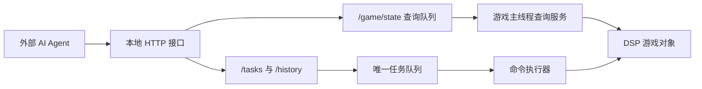

# AutomaticDSP 技术方案

> 当前 M1 实现以 `docs/development-plan.md` 为准：HTTP 使用 .NET 内置 `HttpListener`，JSON 使用 `Newtonsoft.Json`，先实现 `/game`、`POST /game/state`、`/tasks`、`/history`。`POST /game/state` 只使用 GraphQL 作为字段选择 DSL，不提供 GraphQL schema/resolver 框架。
> M1 状态查询只保存在内存中，不默认写入快照文件；主菜单、菜单演示或加载界面不保存游戏内数据快照。
> M1 HTTP 配置项包含 `HTTP.Host` 和 `HTTP.Port`，默认 `127.0.0.1:39270`，可把 host 改成 `0.0.0.0` 供外部调用。

## 总体架构

AutomaticDSP 分为游戏内 Mod 和外部 GraphQL 接口两部分。



游戏内 Mod 负责：

- 在 Unity 主线程读取游戏状态。
- 每 tick 维护轻量游戏运行状态。
- 通过 `POST /game/state` 暴露按需状态查询。
- 通过任务接口提交、查询和取消任务。
- 维护唯一顺序任务队列。
- 在游戏主线程逐帧执行命令。

外部 AI Agent 负责：

- 根据状态查询结果做规划。
- 拆分目标为任务和命令。
- 观察任务状态并在失败时重新规划。

## 工程形态

Mod 使用 BepInEx 5 插件形式加载。插件入口为 `BaseUnityPlugin`。

第一版工程骨架包含：

- BepInEx 插件入口。
- 对 DSP 游戏程序集的引用配置。
- 本地构建说明。

后续再按阶段添加状态查询服务、队列、命令执行器和建造适配器。

`TargetFramework` 保持 `net472`。即使本机安装了 .NET 10 SDK，插件仍需要面向 Unity Mono 和 BepInEx 5 兼容的运行环境。

## 线程模型

Unity 和 DSP 游戏对象只能在游戏主线程安全访问。HTTP 请求线程不得直接读写游戏对象。

推荐模型：

1. `Plugin.Update()` 在主线程维护轻量游戏运行状态并驱动命令执行。
2. HTTP 服务线程只负责接收 `POST /game/state`、解析 GraphQL 字段选择、入队和返回结果。
3. 游戏主线程每 60 game ticks drain 待查询队列，在同一个游戏 tick 内为每个请求生成最终 JSON。
4. HTTP 线程只等待对应请求的最终 JSON 并返回，不做二次字段投影。
5. mutation 不直接修改游戏对象，只把任务提交或取消请求写入线程安全缓冲区。
6. 命令执行器每帧从唯一队列中推进当前任务。

## 模块划分

计划模块：

- `Plugin`：BepInEx 入口，初始化服务。
- `HttpApiServer`：本地 HTTP 服务，默认监听 `127.0.0.1:39270`。
- `StateQueryParser`：只解析 GraphQL 查询 AST，生成字段选择计划。
- `StateSnapshotService`：主线程维护轻量运行状态，并按请求读取游戏对象生成最终 JSON。
- `TaskQueue`：内部唯一顺序任务队列，不作为 GraphQL 实体暴露。
- `CommandExecutor`：逐帧执行命令。
- `ValidationService`：校验科技、背包、地形、碰撞和距离。
- `MovementAdapter`：封装伊卡洛斯移动。
- `InventoryAdapter`：封装背包和手搓制造。
- `BuildAdapter`：封装建筑、传送带、分拣器、配方设置。

## GraphQL 字段选择 DSL

`POST /game/state` 只使用 GraphQL 查询语法表达字段选择，不提供 GraphQL schema、resolver 框架、自省、mutation 或业务字段校验。

HTTP 线程只做三件事：

1. 解析请求体 `{ "query": "...", "operationName": "..." }`。
2. 把 GraphQL selection AST 转成 `StateQueryPlan` 并加入主线程查询队列。
3. 等待主线程生成的最终 JSON，包装成 `{ "data": ... }` 返回。

游戏主线程在查询 tick drain 队列，并为每个请求单独执行字段读取、别名处理和分页处理。这样不会把多个 HTTP 请求合并成一个大对象，也不会让 HTTP 线程在请求之间重新切字段，避免分页边界和同名字段不同参数互相冲突。

### 查询根

第一阶段允许直接选择多个根字段：

- `metadata`
- `game`
- `gameMain`
- `data`
- `player` / `mainPlayer`
- `mecha`
- `inventory` / `package`
- `forge` / `replicator`
- `localPlanet` / `currentPlanet`
- `localStar`
- `factory` / `localFactory`
- `factories`
- `production`
- `power`

未知根字段会按 `GameMain` 静态成员、`GameMain.instance` 成员、`GameMain.data` 成员依次尝试读取；不存在或不可读时返回 `null`。

### 查询规则

- 支持多 root 字段组合查询。
- 支持嵌套字段投影、fragment 和 inline fragment。
- 支持字段别名。
- 列表支持 `limit`、`offset` 和 `where`，默认最多 256 项，单次上限 2048。
- 支持 `_schema` 查询根和对象上的 `_fields` 字段，用于发现可查询入口和字段。
- 不存在或不可读字段返回 `null`。
- 复杂对象未选择子字段时返回 `{}`。
- Unity 对象、委托、方法等不可安全序列化对象不直接返回。

第一阶段不支持：

- GraphQL schema 和自省。
- GraphQL mutation。
- GraphQL 变量求值。
- `orderBy`、空间过滤等高级参数。
- 查询时修改游戏状态。

## 查询示例

一次查询获取玩家、背包、当前行星和当前工厂页：

```graphql
query ObserveFactory {
  metadata {
    gameTick
    localPlanetId
  }
  game {
    gameName
    gameTick
    status
  }
  player {
    planetId
    uPosition {
      x
      y
      z
    }
  }
  inventory {
    grids(limit: 20) {
      itemId
      count
    }
  }
  localPlanet {
    id
    displayName
    factoryLoaded
  }
  factory {
    entityCursor
    entityPool(limit: 100, offset: 0) {
      id
      protoId
      pos {
        x
        y
        z
      }
    }
  }
}
```

同一个请求内读取不同分页时必须使用别名：

```graphql
query PagedFactory {
  firstPage: factory {
    entityPool(limit: 100, offset: 0) {
      id
      protoId
    }
  }
  secondPage: factory {
    entityPool(limit: 100, offset: 100) {
      id
      protoId
    }
  }
}
```

## API 草案

状态查询：

```http
POST /game/state
```

## 过滤、排序与限制

过滤和排序通过 GraphQL argument 表达。当前第一阶段不维护字段白名单：查询层按字段路径尝试读取 `GameMain`、`GameMain.data` 或常用语义根对象，字段不存在、不可读或不可安全序列化时返回 `null`。

M1 已实现的列表参数：

- `limit`：列表返回数量，默认 256，上限 2048。
- `offset`：列表起始偏移，默认 0。
- `where`：列表过滤条件，过滤在 `offset` 和 `limit` 前执行。

`where` 使用对象字面量表达，所有条件按 AND 组合。不支持 `field_exists`，不存在字段参与条件时按匹配失败处理。

```graphql
query FilterFactory {
  factory {
    entityPool(
      where: {
        id_gt: 0
        protoId_in: [2301, 2302]
        pos__x_gte: 0
      }
      limit: 20
    ) {
      id
      protoId
      pos { x y z }
    }
  }
}
```

已支持的后缀包括：无后缀等于、`_ne`、`_gt`、`_gte`、`_lt`、`_lte`、`_contains`、`_startsWith`、`_endsWith`、`_in`。嵌套字段路径用 `__` 分隔，例如 `pos__x_gt`。

分页、字段别名和字段选择在主线程按请求执行。HTTP 线程不把不同请求合并成一个全量对象，也不在返回前重新分页或投影。

后续如果需要排序、矿脉空间查询、物流站专用过滤，可以继续在查询层增加显式参数，例如 `orderBy`、`withinRadius`。这些参数应按实体逐个设计，不提前做复杂通用表达式解释器。

## 任务队列

### 单队列约束

系统只维护一个内部任务队列。所有任务按提交顺序进入同一个队列，命令执行器一次只推进一个任务。

这样做的原因：

- 游戏内建造行为与玩家位置强相关。
- 伊卡洛斯同一时间只能执行一个空间动作。
- 并行任务容易互相改变地形、库存、供电和建筑占位。

### 对外查询方式

队列不是独立实体。查询待执行或执行中的任务使用 `GET /tasks`：

```json
{
  "tasks": [
    {
      "id": "task-id",
      "status": "RUNNING",
      "queueIndex": 0,
      "currentCommandIndex": 1,
      "commands": []
    }
  ]
}
```

查询已完成、失败或取消的历史命令使用 `GET /history`，结果来自 SQLite。

### 任务持久性

第一阶段任务状态只保证当前游戏进程内可查询。游戏退出后不承诺恢复未完成任务。

后续如果需要跨会话恢复，再引入任务日志文件。当前不提前实现。

### 取消语义

取消不是强制打断任意游戏内部调用，而是请求命令执行器尽快进入安全停止状态。

- `QUEUED`：直接标记为 `CANCELLED`。
- `RUNNING`：标记为 `CANCEL_REQUESTED`，当前原子命令结束后转为 `CANCELLED`。
- `SUCCEEDED` / `FAILED` / `CANCELLED`：保持原状态。

## 命令执行

### 命令生命周期

命令状态：

- `PENDING`
- `RUNNING`
- `SUCCEEDED`
- `FAILED`
- `SKIPPED`

任务失败策略：

- 默认 `stopOnFailure = true`。
- 命令失败后，任务标记为 `FAILED`，后续命令不执行。
- 失败结果保留错误码、错误消息、命令 ID 和快照 tick。

### 原子命令

第一阶段每条命令应尽量小，便于取消和失败恢复。

示例：

- 移动到一个点。
- 放置一个建筑。
- 铺设一段传送带。
- 设置一个设施配方。
- 等待一个条件。

不要在一条命令里完成整条生产线。

## 游戏状态查询

`POST /game/state` 是按需状态查询，不维护字段白名单，也不生成完整状态快照。查询根优先支持常用语义入口，例如 `metadata`、`game`、`gameMain`、`data`、`player`、`mainPlayer`、`mecha`、`inventory`、`package`、`forge`、`replicator`、`localPlanet`、`localStar`、`factory`、`factories`、`production`、`power`；其他顶层字段会继续尝试从 `GameMain` 静态成员、`GameMain.instance` 和 `GameMain.data` 读取。

查询规则：

- 只解析 GraphQL selection AST，不提供 schema。
- 不做业务字段校验。
- 不存在或不可读字段返回 `null`。
- 复杂对象未选择子字段时返回 `{}`，避免把“对象存在但未展开”误判为不存在。
- Unity 对象、委托、方法等不可安全序列化对象不直接返回。
- 复杂列表默认最多返回 256 项，支持 `limit`、`offset` 和 `where`，单次 `limit` 上限为 2048。

到玩家、当前行星或任意实体的距离不默认写入 `/game/state`，因为它随天体和玩家位置变化；后续查询层可以根据 `uPosition`、`runtimePosition`、实体位置按需计算。
派生告警、建造上下文和任务决策辅助不放进 `/game/state`，后续根据具体建造命令需求设计独立 context/query。

任务状态不放在 `/game/state` 查询里，第一阶段通过 `GET /tasks` 查询内存中的待执行和执行中命令，通过 `GET /history` 查询 SQLite 中的历史命令。

HTTP 接口层只负责解析查询、入队、返回结果、任务状态和历史命令；读取 GameMain、生成状态 JSON、后续执行游戏内命令的控制逻辑都留在游戏主线程服务中，不在 HTTP handler 中直接触碰 DSP 对象。

`GET /game` 返回主线程每 tick 维护的轻量运行状态。未进入可查询对局时只返回 `ready` 与 `status`；可查询对局中额外返回 `gameName`、tick/time、沙盒开关、创建时间、战斗模式、战斗难度、资源倍率、油倍率和恒星数量。`status` 使用 `loading`、`running`、`paused`、`ended`、`prologue`、`cutscene`、`error`、`menu`、`unknown`，其中 `prologue` 来自 `GameData.guideRunning && !guideComplete`，`cutscene` 来自 `DSPGame.IsCombatCutscene`。

主菜单、菜单演示或加载界面不接受 `/game/state` 查询；如果之前存在 `snapshots/latest.json`、`snapshots/state.json`、`snapshots/galaxy.json`、`snapshots/transport.stations.json`、`snapshots/spheres.json`、`snapshots/localPlanet.factories.json`、早期 `dumps/gameData.json` 或早期 `diagnostics/gameMain.json`，进入非对局状态时应清理。

对于建筑、矿脉等数量较多的实体，查询层必须支持 `limit`，并在后续实体化查询中优先支持空间过滤。

## 安全与访问控制

第一阶段接口只监听本机：

- 地址：`127.0.0.1`
- 默认端口：`39270`

不默认暴露到局域网。后续如需远程控制，应增加显式配置和鉴权。

## 实施阶段

### 阶段 0：文档与工程骨架

交付：

- 需求文档。
- 技术方案。
- BepInEx 插件工程骨架。

验证：

- 仓库结构清晰。
- 工程文件能定位 DSP 游戏程序集和 BepInEx 程序集。

### 阶段 1：只读状态查询

交付：

- `GET /game`。
- `POST /game/state`。
- GraphQL 字段选择 DSL。
- 基础根字段：`metadata`、`game`、`player`、`inventory`、`forge`、`localPlanet`、`factory`、`production`、`power`。
- `GET /tasks` 空实现。
- `GET /history` 空实现。

验证：

- 能通过 `GET /game` 判断可查询状态。
- 能在同一游戏查询 tick 下查询玩家位置和背包。
- 能分页读取当前行星工厂实体。
- 能通过 `GET /tasks` 查询空队列。

### 阶段 2：任务 mutation 与内部队列

交付：

- `enqueueTask`。
- `cancelTask`。
- `Task.commands` 状态输出。
- `waitUntil` 和内部 no-op 测试命令。

验证：

- 多任务按顺序执行。
- `QUEUED` 任务可取消。
- `RUNNING` 任务可安全取消。
- 命令状态只能通过 `Task.commands` 获取。

### 阶段 3：行星内建造命令

交付：

- `moveTo`
- `craftInventory`
- `placeBuilding`
- `placeBelt`
- `placeSorter`
- `setRecipe`

验证：

- 能建造一条简单铁块生产线。
- 材料或科技不足时返回明确错误。

## 风险

主要风险：

- DSP 内部类和字段随版本变化。
- 建造流程可能依赖 UI 状态或游戏内部工具状态。
- Unity 主线程和 GraphQL 服务线程之间需要严格隔离。
- 大型行星状态查询可能产生性能压力。
- GraphQL 库在 BepInEx 5 / Unity Mono 环境中的依赖兼容性需要验证。

缓解策略：

- 把游戏内部访问集中到 Adapter 层。
- `/game/state` 只解析 GraphQL 字段选择 DSL，不暴露 mutation、自省或任意脚本执行。
- 列表查询默认施加服务端上限，并支持 `limit` / `offset`。
- 第一阶段只支持当前行星。
- 优先使用游戏原生建造流程，避免直接改底层数组。
