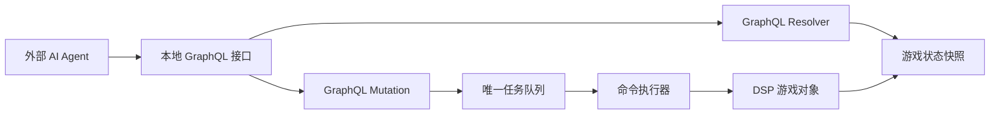

# AutomaticDSP 技术方案

> 当前 M1 实现以 `docs/development-plan.md` 为准：HTTP 使用 .NET 内置 `HttpListener`，JSON 使用 `Newtonsoft.Json`，先实现 `/health`、`/state`、`/tasks`、`/history`。本文中 GraphQL schema 保留为后续查询增强候选，不是 M1 交付范围。
> M1 运行时数据、最新快照和 GameData dump 统一写入 `BepInEx/cache/AutomaticDSP`；主菜单、菜单演示或加载界面不保存游戏内数据快照。
> M1 HTTP 配置项包含 `HTTP.Host` 和 `HTTP.Port`，默认 `127.0.0.1:39270`，可把 host 改成 `0.0.0.0` 供外部调用。

## 总体架构

AutomaticDSP 分为游戏内 Mod 和外部 GraphQL 接口两部分。



游戏内 Mod 负责：

- 在 Unity 主线程读取游戏状态。
- 维护不可变状态快照。
- 通过 GraphQL resolver 暴露查询。
- 接收 GraphQL mutation 提交和取消任务。
- 维护唯一顺序任务队列。
- 在游戏主线程逐帧执行命令。

外部 AI Agent 负责：

- 根据 GraphQL 查询结果做规划。
- 拆分目标为任务和命令。
- 观察任务状态并在失败时重新规划。

## 工程形态

Mod 使用 BepInEx 5 插件形式加载。插件入口为 `BaseUnityPlugin`。

第一版工程骨架包含：

- BepInEx 插件入口。
- 对 DSP 游戏程序集的引用配置。
- 本地构建说明。

后续再按阶段添加 GraphQL 服务、快照服务、队列、命令执行器和建造适配器。

`TargetFramework` 保持 `net472`。即使本机安装了 .NET 10 SDK，插件仍需要面向 Unity Mono 和 BepInEx 5 兼容的运行环境。

## 线程模型

Unity 和 DSP 游戏对象只能在游戏主线程安全访问。GraphQL 请求线程不得直接读写游戏对象。

推荐模型：

1. `Plugin.Update()` 在主线程驱动状态采样和命令执行。
2. GraphQL 服务线程只负责接收请求、执行 resolver 和返回快照数据。
3. 常规 query 读取最近一次不可变快照。
4. 需要强一致即时结果时，将采样请求投递到主线程并等待新快照。
5. mutation 不直接修改游戏对象，只把任务提交或取消请求写入线程安全缓冲区。
6. 命令执行器每帧从唯一队列中推进当前任务。

## 模块划分

计划模块：

- `Plugin`：BepInEx 入口，初始化服务。
- `GraphQLServer`：本地 GraphQL 服务，仅监听 `127.0.0.1`。
- `Schema`：GraphQL 类型、查询和 mutation 定义。
- `Resolvers`：从快照读取数据，完成过滤、排序、分页。
- `GameSnapshotService`：生成不可变游戏状态快照。
- `TaskQueue`：内部唯一顺序任务队列，不作为 GraphQL 实体暴露。
- `CommandExecutor`：逐帧执行命令。
- `ValidationService`：校验科技、背包、地形、碰撞和距离。
- `MovementAdapter`：封装伊卡洛斯移动。
- `InventoryAdapter`：封装背包和手搓制造。
- `BuildAdapter`：封装建筑、传送带、分拣器、配方设置。

## GraphQL Schema 设计

### 查询入口

所有查询通过 `snapshot` 进入。

```graphql
type Query {
  snapshot(mode: SnapshotMode = LATEST): Snapshot!
}
```

`snapshot` 返回不可变对象。单次 GraphQL query 中选取的所有字段都来自同一个 `Snapshot` 实例。

```graphql
type Snapshot {
  tick: Long!
  gameTick: Long!
  player: Player!
  inventory: Inventory!
  technology: Technology!
  currentPlanet: Planet
  planets(where: PlanetWhere, orderBy: PlanetOrder, limit: Int): [Planet!]!
  buildings(where: BuildingWhere, orderBy: BuildingOrder, limit: Int): [Building!]!
  veins(where: VeinWhere, orderBy: VeinOrder, limit: Int): [Vein!]!
  recipes(where: RecipeWhere, limit: Int): [Recipe!]!
  items(where: ItemWhere, limit: Int): [Item!]!
  tasks(where: TaskWhere, orderBy: TaskOrder, limit: Int): [Task!]!
  task(id: ID!): Task
}
```

### 任务模型

`task` 是可查询实体。`task_queue` 不是实体，队列视图通过 `tasks(where: { type: QUEUE })` 获取。

```graphql
type Task {
  id: ID!
  clientRequestId: String
  type: TaskType!
  status: TaskStatus!
  queueIndex: Int
  currentCommandIndex: Int
  createdAt: DateTime!
  updatedAt: DateTime!
  error: TaskError
  commands: [TaskCommand!]!
}

enum TaskType {
  QUEUE
}

enum TaskStatus {
  QUEUED
  RUNNING
  SUCCEEDED
  FAILED
  CANCEL_REQUESTED
  CANCELLED
}

type TaskCommand {
  id: String!
  type: CommandType!
  status: CommandStatus!
  startedAt: DateTime
  completedAt: DateTime
  error: TaskError
}
```

`TaskCommand` 不是可独立查询实体。它没有顶层 query field，也没有全局列表入口，只能通过 `Task.commands` 读取。

### Mutation

任务提交和取消通过 GraphQL mutation 完成。

```graphql
type Mutation {
  enqueueTask(input: EnqueueTaskInput!): EnqueueTaskPayload!
  cancelTask(id: ID!): CancelTaskPayload!
}
```

mutation 只影响任务队列状态，不允许直接绕过队列修改游戏对象。

## 查询示例

一次查询获取玩家、背包、附近建筑和队列任务：

```graphql
query ObserveFactory {
  snapshot {
    tick
    player {
      planetId
      position {
        x
        y
        z
      }
      buildRange
    }
    inventory {
      items {
        itemId
        count
      }
    }
    buildings(
      where: {
        planetId: CURRENT_PLANET
        kindIn: [MINER, SMELTER]
        withinRadius: { center: PLAYER_POSITION, radius: 80 }
      }
      orderBy: { field: DISTANCE_TO_PLAYER, direction: ASC }
      limit: 100
    ) {
      id
      kind
      prototypeId
      position {
        x
        y
        z
      }
      recipeId
      workState
    }
    tasks(where: { type: QUEUE }, orderBy: { field: QUEUE_INDEX, direction: ASC }) {
      id
      status
      queueIndex
      currentCommandIndex
      commands {
        id
        type
        status
        error {
          code
          message
        }
      }
    }
  }
}
```

查询单个任务：

```graphql
query TaskStatus($id: ID!) {
  snapshot {
    tick
    task(id: $id) {
      id
      status
      currentCommandIndex
      error {
        code
        message
      }
      commands {
        id
        type
        status
      }
    }
  }
}
```

## API 草案

GraphQL：

```http
POST /graphql
```

健康检查：

```http
GET /health
```

第一阶段不再提供独立 `POST /query`、`POST /tasks` 或 `POST /tasks/{taskId}/cancel`。对应能力由 GraphQL query 和 mutation 承担。

## 过滤、排序与限制

过滤和排序通过 GraphQL input object 表达。第一阶段只实现明确白名单字段，不暴露任意字段名查询。

建筑过滤示例：

```graphql
input BuildingWhere {
  id: ID
  planetId: PlanetSelector
  kindIn: [BuildingKind!]
  withinRadius: RadiusFilter
  withinBBox: BBoxFilter
}
```

任务过滤示例：

```graphql
input TaskWhere {
  id: ID
  clientRequestId: String
  type: TaskType
  statusIn: [TaskStatus!]
}
```

选择白名单 input object 的原因：

- Schema 自带校验和自省能力。
- 不需要实现任意表达式解析器。
- 可以显式限制昂贵查询。
- 更容易为 AI Agent 生成稳定工具描述。

## 任务队列

### 单队列约束

系统只维护一个内部任务队列。所有任务按提交顺序进入同一个队列，命令执行器一次只推进一个任务。

这样做的原因：

- 游戏内建造行为与玩家位置强相关。
- 伊卡洛斯同一时间只能执行一个空间动作。
- 并行任务容易互相改变地形、库存、供电和建筑占位。

### 对外查询方式

队列不是实体。查询队列中的任务：

```graphql
query Queue {
  snapshot {
    tasks(where: { type: QUEUE }, orderBy: { field: QUEUE_INDEX, direction: ASC }) {
      id
      status
      queueIndex
    }
  }
}
```

### 任务持久性

第一阶段任务状态只保证当前游戏进程内可查询。游戏退出后不承诺恢复未完成任务。

后续如果需要跨会话恢复，再引入任务日志文件。当前不提前实现。

### 取消语义

取消不是强制打断任意游戏内部调用，而是请求命令执行器尽快进入安全停止状态。

- `QUEUED`：直接标记为 `CANCELLED`。
- `RUNNING`：标记为 `CANCEL_REQUESTED`，当前原子命令结束后转为 `CANCELLED`。
- `SUCCEEDED` / `FAILED` / `CANCELLED`：保持原状态。

## 命令执行

### 命令生命周期

命令状态：

- `PENDING`
- `RUNNING`
- `SUCCEEDED`
- `FAILED`
- `SKIPPED`

任务失败策略：

- 默认 `stopOnFailure = true`。
- 命令失败后，任务标记为 `FAILED`，后续命令不执行。
- 失败结果保留错误码、错误消息、命令 ID 和快照 tick。

### 原子命令

第一阶段每条命令应尽量小，便于取消和失败恢复。

示例：

- 移动到一个点。
- 放置一个建筑。
- 铺设一段传送带。
- 设置一个设施配方。
- 等待一个条件。

不要在一条命令里完成整条生产线。

## 游戏状态快照

快照应包含 GraphQL 可访问的实体数据。快照对象一旦生成，不再修改。

第一阶段建议先实现增量较低的全量当前行星快照，再按性能瓶颈优化空间索引。

第一阶段已确定保存的稳定状态字段：

- `metadata`：快照 ID、游戏 tick、采样时间、采样耗时、当前恒星/行星 ID、schema 版本。
- `game`：存档名、创建时间、运行 tick/time、生命周期状态、菜单演示状态、当前位置、星系摘要、工厂数量、戴森球数量、根系统可用性。
- `data`：`GameMain.data` 的可序列化快照；顶层成员尽量保留，运行时对象转为摘要，不让 HTTP 层持有 Unity/DSP 对象。
- `player`：伊卡洛斯位置、宇宙位置、朝向、移动状态、是否在行星上、建造范围和交互范围。
- `mecha`：生命、核心能量、反应堆能量、沙土、建造无人机状态。
- `inventory`：背包槽位、空槽、物品列表和按物品汇总。
- `replicator`：背包制造队列字段先保留结构，后续补齐映射。
- `research`：当前研究、研究队列、hash 速率和停滞状态。
- `currentPlanet`：当前行星基础信息、风能/太阳能倍率、资源矿脉摘要。
- `factory`：当前行星工厂摘要、玩家附近建筑、建筑类型汇总、传送带/分拣器数量和附近缺电建筑。
- `production`：当前行星生产、消耗和电力统计寄存器的非零项。
- `power`：电网数量、蓄电量、发电/耗电/充放电统计。
- `alerts`：由快照推导出的缺电、研究停滞等告警。
- `buildContext`：当前建造作用域、背包关键建筑、手搓候选和材料缺口、基础铁块线需求、附近资源、附近基础设施、电力摘要。

`debug` 不作为 `/state` 字段返回。`/state` 本身是 GameMain 可序列化状态快照：保留 `metadata`，用 `game` 表示运行状态，用 `data` 表示 `GameMain.data`。完整 GameData dump 另写到 `BepInEx/cache/AutomaticDSP/dumps/gameData.json`，使用格式化 JSON 便于对比。

任务状态不放在 `/state` 快照里，第一阶段通过 `GET /tasks` 查询内存中的待执行和执行中命令，通过 `GET /history` 查询 SQLite 中的历史命令。

HTTP 接口层只负责读取内存快照、任务状态和历史命令；采样 GameMain、后续执行游戏内命令的控制逻辑都留在游戏主线程服务中，不在 HTTP handler 中直接触碰 DSP 对象。

主菜单、菜单演示或加载界面不生成快照；如果之前存在 `snapshots/latest.json`、`dumps/gameData.json` 或早期 `diagnostics/gameMain.json`，进入非对局状态时应清理。

对于建筑、矿脉等数量较多的实体，resolver 必须支持 `limit`，并优先支持空间过滤。

## 安全与访问控制

第一阶段接口只监听本机：

- 地址：`127.0.0.1`
- 默认端口：`39270`

不默认暴露到局域网。后续如需远程控制，应增加显式配置和鉴权。

## 实施阶段

### 阶段 0：文档与工程骨架

交付：

- 需求文档。
- 技术方案。
- BepInEx 插件工程骨架。

验证：

- 仓库结构清晰。
- 工程文件能定位 DSP 游戏程序集和 BepInEx 程序集。

### 阶段 1：只读 GraphQL snapshot

交付：

- `POST /graphql`。
- `snapshot` 查询根。
- 基础实体：`player`、`inventory`、`technology`、`planet`、`building`、`vein`、`task`。

验证：

- 能在同一 `snapshot.tick` 下查询玩家位置和背包。
- 能查询当前行星附近建筑。
- 能通过 `tasks(where: { type: QUEUE })` 查询空队列。

### 阶段 2：任务 mutation 与内部队列

交付：

- `enqueueTask`。
- `cancelTask`。
- `Task.commands` 状态输出。
- `waitUntil` 和内部 no-op 测试命令。

验证：

- 多任务按顺序执行。
- `QUEUED` 任务可取消。
- `RUNNING` 任务可安全取消。
- 命令状态只能通过 `Task.commands` 获取。

### 阶段 3：行星内建造命令

交付：

- `moveTo`
- `craftInventory`
- `placeBuilding`
- `placeBelt`
- `placeSorter`
- `setRecipe`

验证：

- 能建造一条简单铁块生产线。
- 材料或科技不足时返回明确错误。

## 风险

主要风险：

- DSP 内部类和字段随版本变化。
- 建造流程可能依赖 UI 状态或游戏内部工具状态。
- Unity 主线程和 GraphQL 服务线程之间需要严格隔离。
- 大型行星状态查询可能产生性能压力。
- GraphQL 库在 BepInEx 5 / Unity Mono 环境中的依赖兼容性需要验证。

缓解策略：

- 把游戏内部访问集中到 Adapter 层。
- GraphQL schema 只暴露稳定 DTO，不暴露 DSP 内部类。
- 列表 resolver 默认要求 `limit` 或施加服务端上限。
- 第一阶段只支持当前行星。
- 优先使用游戏原生建造流程，避免直接改底层数组。
